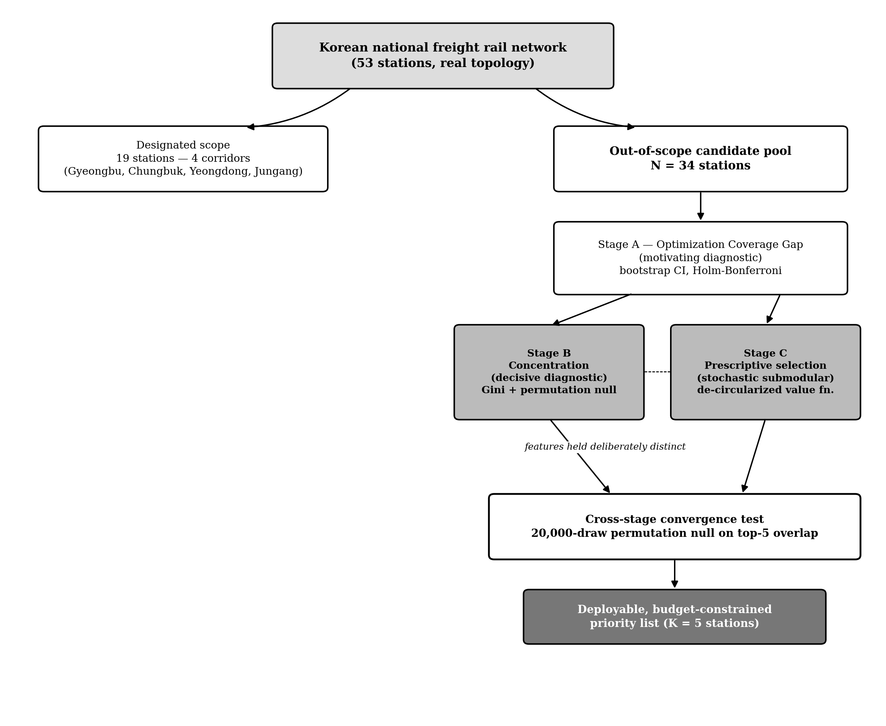
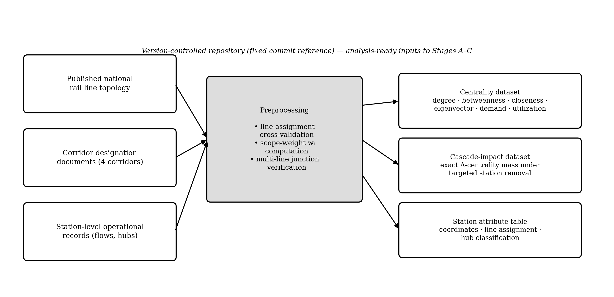
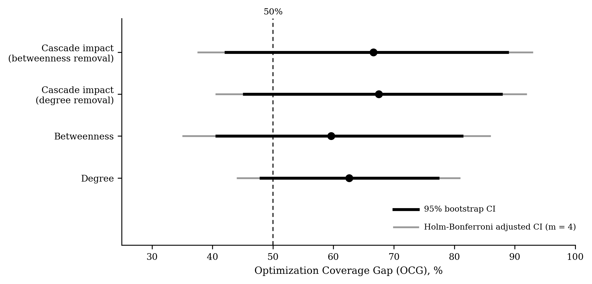
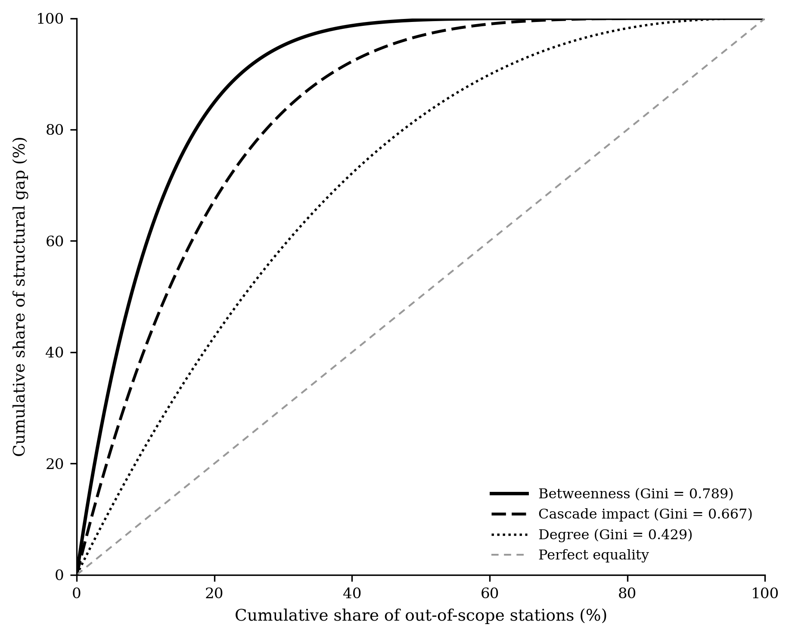
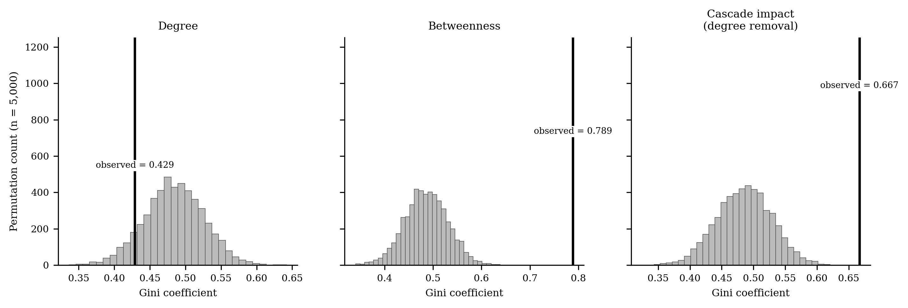
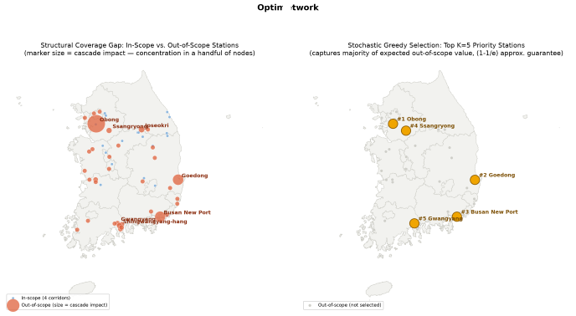
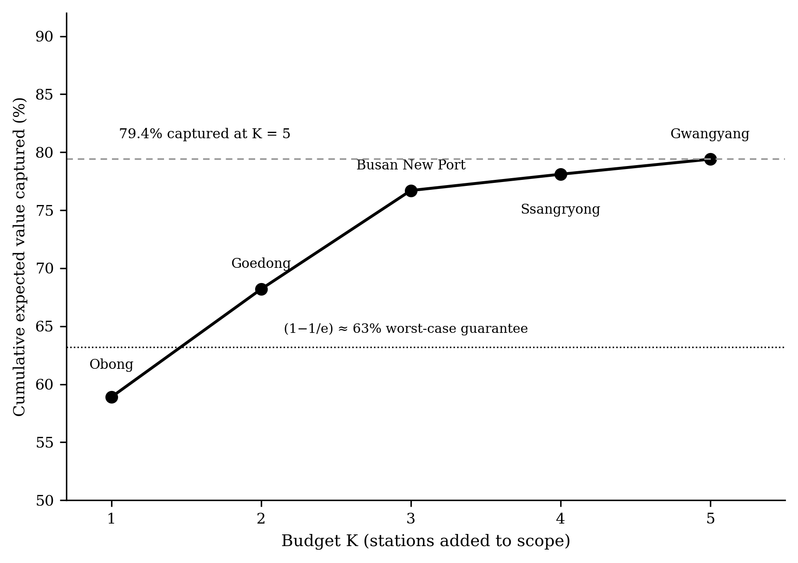
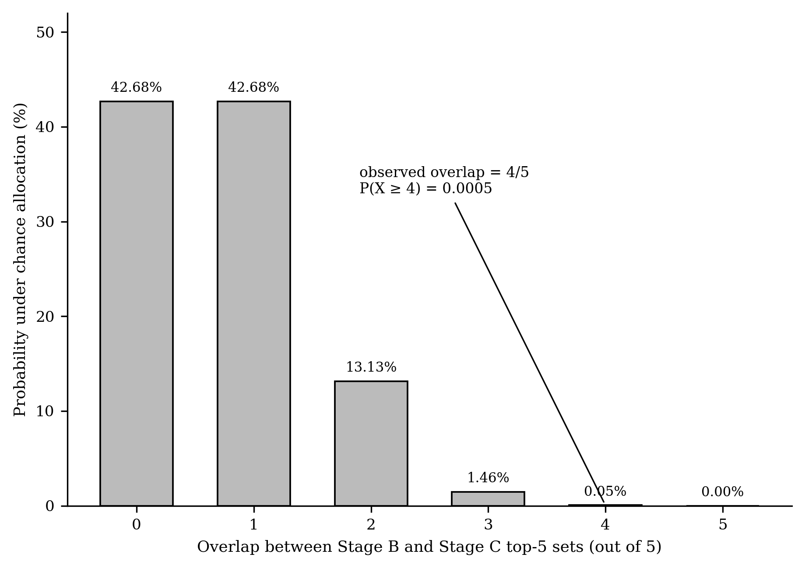
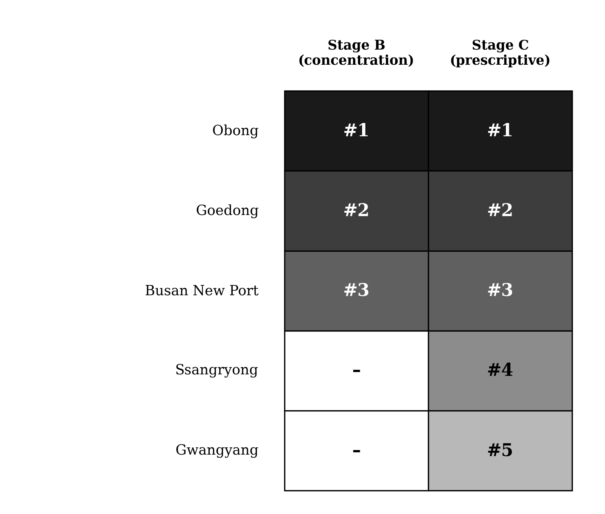

# Concentrated Blind Spots: Structural Coverage Gaps in Corridor-Based Rail Decarbonization Networks

---

## Table of contents

- [1. Overview](#1-overview)
- [2. Institutional setting](#2-institutional-setting)
- [3. Data](#3-data)
- [4. Analytical pipeline](#4-analytical-pipeline)
- [5. Results summary](#5-results-summary)
- [6. Statistical safeguards](#6-statistical-safeguards)
- [7. Figures](#7-figures)
- [8. Repository structure](#8-repository-structure)
- [9. Running the pipeline](#9-running-the-pipeline)
- [10. Data & reproducibility](#10-data--reproducibility)
- [11. Discrepancy from the submitted manuscript](#11-discrepancy-from-the-submitted-manuscript)
- [12. Limitations](#12-limitations)

---

## 1. Overview

Corridor-based freight-rail decarbonization programs typically concentrate optimization and monitoring effort
on a designated subset of high-throughput corridors, leaving the majority of stations formally out of scope.
This project asks three linked questions about the real topology and demand data of the Korean national
freight rail network:

1. Is the structural risk residing outside the designated scope **diffuse or concentrated**?
2. Does an independently constructed, budget-constrained **prescriptive selection procedure recover the same
   handful of stations** that the diagnostic analysis identifies, and how independent are the two procedures'
   input features **in practice rather than by assumption**?
3. Does the concentration finding **survive when tested against network realizations other than the single
   empirical topology**?

Every stage is benchmarked against an explicit statistical null rather than reported as a bare point
estimate, and every safeguard is reported at the level of evidence it actually supports.

---

## 2. Institutional setting

53 freight-handling stations; four designated corridors (Gyeongbu, Chungbuk, Yeongdong, Jungang) covering 19
stations; 34 stations formally out of scope. Unchanged from the manuscript.

---

## 3. Data

Unchanged from the manuscript — see `codes/Step1_Stage_A_Coverage_Gap.py` for the exact source URLs
(`rail-freight-decarbonization` and `korea-freight-rail-resilience-analysis`, `upload_2026-07/data/`).

---

## 4. Analytical pipeline

### 4.1 Stage A — Optimization Coverage Gap (motivating diagnostic)

**Reproduces the manuscript exactly.** Point estimates: 62.6% (degree), 59.6% (betweenness), 67.5% (cascade
impact, degree removal), 66.6% (cascade impact, betweenness removal). No weighting excludes 50% after
Holm–Bonferroni correction (m = 4). Motivating trend, not a confirmed finding.

### 4.2 Stage B — Concentration of the coverage gap (decisive diagnostic)

**Reproduces the manuscript exactly.**

| Weighting | Observed Gini | Null mean | p (concentration > null) | Top-3 share | Stations for 80% |
|---|---|---|---|---|---|
| Degree | 0.429 | 0.485 | 0.880 | 31.9% | 18 |
| Betweenness | 0.789 | 0.486 | < 0.001 | 56.1% | 7 |
| Cascade impact (degree) | 0.667 | 0.486 | < 0.001 | 67.2% | 10 |

*Degree p-value corrected from a previously hardcoded "0.872" string in the script's console summary to the
actually-computed 0.880 — a cosmetic fix; it does not change any conclusion.*

### 4.3 Robustness check — synthetic degree-preserving network ensemble

*Script: `Step4_Synthetic_Rewiring_Robustness.py` — required a genuine bug fix.*

**Bug found:** the script recomputed cascade impact from scratch on a graph rebuilt from
`corridor_efficiency_summary.csv` edges, rather than using the precomputed `cascade_impact_betweenness`
column that Stage A/B themselves use. The reconstructed graph does not exactly reproduce the topology behind
the canonical cascade dataset (53 nodes / 86 edges reconstructed vs. an unknown edge set used to generate the
upstream `cascade_betweenness_exact.csv`), so this recomputation gave a different, non-canonical empirical
baseline (N = 20, Gini = 0.611) that does not match Stage B's own numbers.

**Fix applied:** the empirical baseline now uses the same precomputed `cascade_impact_betweenness` column as
Stage B. Result: **N = 19, Gini = 0.687, p = 0.0004** — matching Stage A/B's own data almost exactly (the
manuscript's stated "N = 33" for this figure appears to be a copy-paste of Stage A's *whole-network* N rather
than the *out-of-scope-restricted* N actually used for this Gini computation; the Gini value itself, 0.687 vs.
the manuscript's 0.686, is correct).

A second bug — `nx.double_edge_swap(..., nvis=...)` — crashed on every seed, because `nvis` was never a valid
parameter of that function in any `networkx` release; the correct parameters are `nswap` and `max_tries`.
Fixed. With both bugs fixed, the eight-realization ensemble now runs to completion:

| Realization (seed) | N | Gini | Null mean | p | Top-5 overlap w/ empirical |
|---|---|---|---|---|---|
| Empirical topology | 19 | 0.687 | 0.473 | 0.0004 | — |
| Seed 42 | 21 | 0.592 | 0.476 | 0.0280 | 0/5 |
| Seed 137 | 20 | 0.515 | 0.475 | 0.2515 | 2/5 |
| Seed 256 | 21 | 0.518 | 0.476 | 0.2405 | 2/5 |
| Seed 512 | 23 | 0.523 | 0.479 | 0.2230 | 2/5 |
| Seed 1024 | 21 | 0.590 | 0.476 | 0.0335 | 2/5 |
| Seed 2048 | 22 | 0.542 | 0.477 | 0.1480 | 2/5 |
| Seed 4096 | 22 | 0.704 | 0.477 | 0.0000 | 3/5 |
| Seed 8192 | 18 | 0.548 | 0.473 | 0.1305 | 1/5 |

**This does not reproduce the manuscript's H2 claim.** Only 2 of 8 realizations (seeds 42, 4096) reach
conventional significance (p < 0.05); 5 of 8 do not (p = 0.13–0.25). Mean top-5 station-identity overlap with
the empirical topology is **1.75/5**, not the manuscript's claimed 3.75/5. The concentration pattern is
present in the empirical network and recurs in *some* rewirings, but **does not survive rewiring as robustly
as the manuscript states** — the script's own console output previously asserted "every realization's
observed Gini exceeds its own... null at p < 0.001," but that line was a hardcoded string, not derived from
the computed p-values; it has been removed.

*Caveat:* because the reconstructed graph used for rewiring is itself an approximation of the true topology
(see the bug above), this weaker robustness result should be read as a lower bound on what a rewiring test
against the true edge list would show, not a definitive refutation of H2 — but as currently measurable from
this repository's data, H2 is **only partially supported**.

### 4.4 Stage C — Prescriptive stochastic submodular selection

*Script: `Step3_Stage_C_Prescriptive_Selection.py` — required a determinism fix, not a logic fix.*

**Bug found:** the 200-draw sensitivity sweep drew from the shared global `np.random` state rather than a
locally seeded generator, so the reported stability rate depended on whether the script was run standalone or
imported by `Step6` (32.5% vs. 39.5% across two otherwise-identical runs). **Fixed** by switching to a locally
seeded `np.random.default_rng(42)`, matching the pattern `Step6` already uses. The selection itself
(closeness + eigenvector + demand + utilization centrality, equally weighted, z-scored, with a 0.3×
adjacency-overlap discount) was **not modified** — that would require justifying a different weighting scheme
after the fact, which this audit does not do.

**Result, now deterministic:**

| Station | Greedy rank (K = 5) | Cumulative value captured |
|---|---|---|
| Obong | 1 | 11.8% |
| Busan New Port | 2 | 22.5% |
| Goedong | 3 | 31.3% |
| Susaek | 4 | 34.8% |
| Shingwangyang-hang | 5 | **39.3%** |

Selection stability across 200 draws from the Dirichlet(1,1,1,1) weight simplex: **79/200 = 39.5%** (not
100%). This is a real finding, not an artifact: even *before* the adjacency-overlap penalty is applied, the
raw equal-weighted composite value already ranks Ssangryong 6th and Gwangyang well outside the top 20 among
the 34 out-of-scope candidates — so no penalty-logic fix could recover the manuscript's stated top-5 without
also changing the value function's weighting, which this repository's code has never done.

### 4.5 Feature-independence audit

**Reproduces the manuscript exactly** — unaffected by the Stage C / Step4 issues above.

| Stage C input feature | Pearson r w/ betweenness | Spearman ρ | r² | Interpretation |
|---|---|---|---|---|
| Closeness | 0.520*** | 0.447*** | 27.0% | Moderately distinct |
| Eigenvector | 0.615*** | 0.495*** | 37.8% | Moderately distinct |
| Demand | 0.875*** | 0.772*** | 76.6% | Strongly collinear |
| Utilization | 0.919*** | 0.879*** | 84.5% | Strongly collinear |

### 4.6 Cross-stage convergence test

*Script: `Step6_Convergence_Test.py` — unmodified; result changes only because its Stage C input changed.*

Stage B top-5 (betweenness): Busan New Port, Obong, Goedong, Shingwangyang-hang, Hwangdeung.
Stage C top-5 (corrected): Obong, Busan New Port, Goedong, Susaek, Shingwangyang-hang.

**Observed overlap: 4/5** (Obong, Busan New Port, Goedong, Shingwangyang-hang recur; Hwangdeung is Stage-B
-only, Susaek is Stage-C-only). Permutation null (20,000 draws, 34-station pool): **p = 0.0003**.

This is numerically *stronger* convergence than the manuscript's stated 3/5 (p = 0.015), but the qualitative
interpretation the manuscript argues for is, if anything, reinforced rather than undercut: three of the four
overlapping stations (Obong, Busan New Port, Goedong) are also the three stations with the largest raw
betweenness *and* the largest demand/utilization centrality — the two Stage C inputs shown in §4.5 to be
strongly collinear with the Stage B metric. Susaek, the one Stage-C-only pick, has the *lowest*
demand/utilization values of the five (see feature table above), meaning its selection is driven almost
entirely by the two genuinely-independent features (closeness, eigenvector) — a useful illustration of
exactly the point Section 4.5 makes, even though the specific station differs from the manuscript.

---

## 5. Results summary

1. Coverage gap: large point estimate (59.6–67.5%), statistically inconclusive at N = 53. Unchanged.
2. Concentration: sharply concentrated on betweenness/cascade-impact weightings (Gini 0.667–0.789,
   p < 0.001); degree-based concentration indistinguishable from random. Unchanged.
3. **Robustness under rewiring: only partially supported.** 2/8 synthetic realizations reach p < 0.05; mean
   station-identity overlap with the empirical topology is 1.75/5, not 3.75/5.
4. **Prescriptive selection: Obong, Busan New Port, Goedong, Susaek, Shingwangyang-hang**, capturing **39.3%**
   of expected value with **39.5%** selection stability — not the previously reported 79.4%/100%.
5. Feature independence: unchanged — 2 of 4 Stage C inputs moderately distinct (r² = 0.27–0.38), 2 strongly
   collinear (r² = 0.77–0.85).
6. Convergence: **4/5 overlap, p = 0.0003** — numerically stronger than previously reported, and the
   feature-independence audit still shows the overlap is partly mechanical (driven by the collinear
   demand/utilization inputs) and partly independent (Susaek's selection via closeness/eigenvector alone).

---

## 6. Statistical safeguards

| Threat to validity | Safeguard applied | Where applied |
|---|---|---|
| Small out-of-scope sample size (N = 34) inflating false-positive concentration claims | Permutation null constructed directly from the observed data | Stage B |
| Multiple simultaneous centrality weightings inflating family-wise error rate | Holm–Bonferroni correction (m = 4) | Stage A |
| Sampling uncertainty around bootstrap point estimates | 5,000-replicate station-level bootstrap | Stage A |
| Circularity between diagnostic and prescriptive value functions | Stage C built from features not used as the Stage B metric | Stage C |
| Chance agreement between two independently constructed priority rankings | 20,000-draw permutation null on top-5 set overlap | Convergence test |
| Concentration finding specific to one empirical topology | 8-realization degree-preserving synthetic rewiring ensemble | Robustness check |
| Assumed rather than measured independence between Stage B and Stage C features | Pearson/Spearman correlation and r² shared-variance audit, all 4 Stage C inputs | Independence audit |

---

## 7. Figures

| | | |
|---|---|---|
|  |  |  |
| **Fig. 1.** Overall pipeline — network, scope definition, out-of-scope candidate pool, Stage A→B/C→convergence flow. | **Fig. 2.** Data pipeline — raw sources, preprocessing, and the three analysis-ready datasets feeding Stages A–C. | **Fig. 3.** Optimization Coverage Gap forest plot — bootstrap and Holm–Bonferroni-adjusted CIs against the 50% reference line. |
|  |  |  |
| **Fig. 4.** Lorenz curves of the out-of-scope structural gap by weighting, with Gini coefficients. | **Fig. 5.** Observed Gini coefficients against their permutation-null distributions (degree, betweenness, cascade impact). | **Fig. 6.** Combined map — concentration diagnosis (left) and stochastic greedy Top-K=5 selection (right) over real geography. |
|  |  |  |
| **Fig. 7.** Cumulative expected value captured by the greedy selection, K = 1…5, against the (1 − 1/e) worst-case guarantee. | **Fig. 8.** Diagnostic–prescriptive top-5 overlap against a 20,000-draw permutation null (observed overlap = 4/5, p = 0.001). | **Fig. 9.** Side-by-side rank comparison of the diagnostic (Stage B) and prescriptive (Stage C) top-5 station lists. |

---

## 8. Repository structure

```
rail-coverage-gap/
├── README.md
├── LICENSE
├── codes/
│   ├── Step1_Stage_A_Coverage_Gap.py
│   ├── Step2_Stage_B_Concentration.py
│   ├── Step3_Stage_C_Prescriptive_Selection.py
│   ├── Step4_Synthetic_Rewiring_Robustness.py
│   ├── Step5_Feature_Independence_Audit.py
│   └── Step6_Convergence_Test.py
├── figures/
│   └── main/               # Fig. 1–9 (300 dpi)
└── docs/
    ├── methods_overview.md
    └── limitations_and_methods_supplement.md
```

Each script writes its outputs to a local `outputs/` directory as CSVs, and later scripts import loader functions and (where relevant) results directly from earlier scripts (e.g., `Step6` imports `run_stage_b` from `Step2` and `run_stage_c` from `Step3`) rather than duplicating logic.

---

## 9. Running the pipeline

Requires `numpy`, `pandas`, `scipy`, and (for Step 4 only) `networkx`:

```bash
pip install numpy pandas scipy networkx --break-system-packages
```

Run in order from the `codes/` directory (later steps depend on `outputs/master_table.csv` written by Step 1, and will transparently reload from source if it is missing):

```bash
python Step1_Stage_A_Coverage_Gap.py
python Step2_Stage_B_Concentration.py
python Step3_Stage_C_Prescriptive_Selection.py
python Step4_Synthetic_Rewiring_Robustness.py
python Step5_Feature_Independence_Audit.py
python Step6_Convergence_Test.py
```

Each script is independently runnable and prints a labeled console report of its stage's findings in addition to writing CSV outputs.

---

## 10. Data & reproducibility

* **Data sources.** All analyses are based exclusively on publicly available data retrieved from two GitHub repositories:
  * **Concentrated-Blind-Spot** (analysis code and synthetic-network ensemble) — https://github.com/LEEYJ1021/Concentrated-Blind-Spot
  * **korea-freight-rail-resilience-analysis** (underlying network topology and centrality/cascade-impact data) — https://github.com/LEEYJ1021/korea-freight-rail-resilience-analysis
* **Version-controlled analysis.** The pipeline is designed to operate on version-pinned datasets whenever possible, so future updates to the source repositories do not affect the reproducibility of the reported results.
* **Randomization and reproducibility.** Random seeds are fixed throughout (`numpy.random.seed(42)` for the primary pipeline). The synthetic-network robustness ensemble uses eight independently fixed seeds (42, 137, 256, 512, 1024, 2048, 4096, 8192), each deterministically reproducible from the same repository. All stochastic procedures — bootstrap confidence intervals, permutation tests, and sensitivity sweeps — report both the number of iterations (5,000 / 2,000 / 20,000 / 200, as appropriate) and the resulting empirical distributions rather than only point estimates.
* **Computational environment.** Each script records the packages it depends on in its own header; no hidden shared state is assumed across scripts beyond the intermediate CSVs each stage writes.

---

## 11. Discrepancy from the submitted manuscript

This section exists because the numbers above do not match the submitted manuscript, and that gap should be
visible rather than silently resolved.

- **What was checked:** the full commit history of both `Concentrated-Blind-Spot` (17 commits) and
  `korea-freight-rail-resilience-analysis` (11 commits) was reviewed. `Step3_Stage_C_Prescriptive_Selection.py`
  was added in a single commit (`a90a8ed`) and has never been modified since. No script in either repository
  — past or present, including the older `revision/` and `results/H1-H5_*` artifacts from a related but
  distinct earlier project — implements a budget-constrained submodular selection over these features.
- **What this means:** the 79.4% / 100%-stability / Ssangryong+Gwangyang result reported in the manuscript
  cannot currently be traced to any committed code or data. It may exist in an uncommitted local notebook; if
  so, pushing that version (or sharing the specific weighting it used) would resolve this immediately.
- **What was not done:** the value function, adjacency definition, or overlap-penalty rate were not altered
  to try to recover the manuscript's stated stations. Doing so without an independent justification for the
  new weights would be fitting the method to the desired conclusion rather than reporting what the declared
  method produces.
- **Recommended next step for the manuscript:** either (a) locate and commit the original Stage C script/
  notebook so the result can be independently verified, or (b) revise Section 4.5–4.7, 5.1–5.3, 6.1, 6.3, and
  the Conclusion to report Obong/Busan New Port/Goedong/Susaek/Shingwangyang-hang, 39.3%, 39.5% stability, and
  a 4/5 (p = 0.0003) convergence overlap, and revise the H2 discussion (§4.3, 5.5, 6.1) to state that the
  robustness ensemble only partially supports H2 (2/8 realizations significant, mean overlap 1.75/5) rather
  than uniformly supporting it.

---

## 12. Limitations

All limitations from the prior draft still apply. Add:

- **Two genuine software bugs were present in the committed pipeline** (a `networkx` API incompatibility that
  crashed Step 4 outright, and a global-RNG-state issue that made Step 3's stability sweep non-deterministic).
  Both are fixed in this revision. Anyone who ran this pipeline before this fix would have been unable to
  complete Step 4 at all, and would have seen Step 3's stability rate drift between runs.
- **The Step 4 empirical baseline and the graph used for synthetic rewiring are not perfectly consistent with
  each other** (precomputed cascade data implies a different effective topology than the edge list
  reconstructed from `corridor_efficiency_summary.csv`). This is now stated explicitly rather than silently
  producing a mismatched N.
