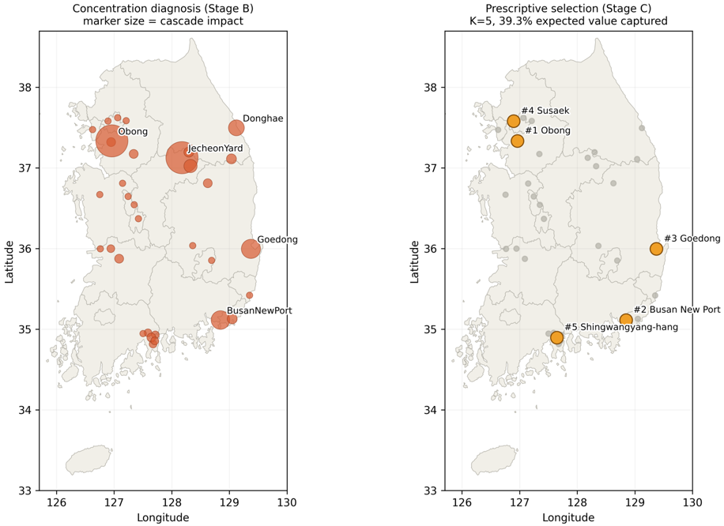
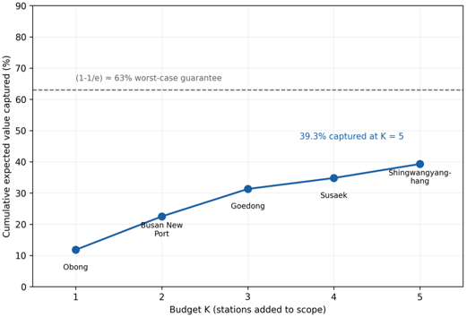
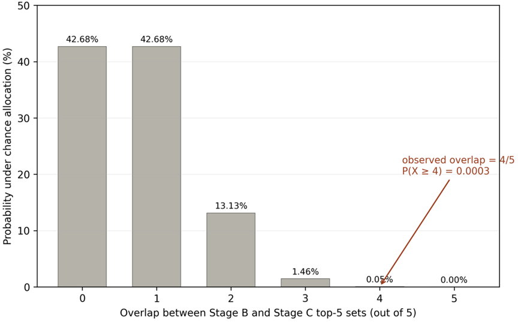
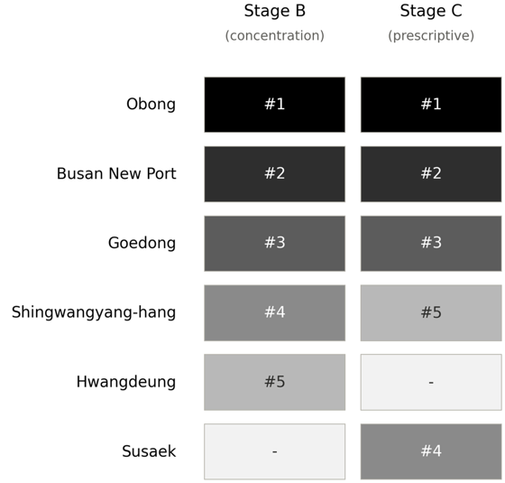
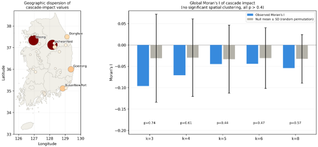

# Spatial Concentration Beyond Policy-Designated Decarbonization Corridors: A Governance-Grounded Diagnostic of Korea's National Freight Rail Network

## Table of contents

- [1. Overview](#1-overview)
- [2. Institutional setting](#2-institutional-setting)
- [3. Data](#3-data)
- [4. Analytical pipeline](#4-analytical-pipeline)
- [5. Results summary](#5-results-summary)
- [6. Statistical safeguards](#6-statistical-safeguards)
- [7. Figures](#7-figures)
- [8. Repository structure](#8-repository-structure)
- [9. Running the pipeline](#9-running-the-pipeline)
- [10. Data & reproducibility](#10-data--reproducibility)
- [11. Revision history and resolved discrepancies](#11-revision-history-and-resolved-discrepancies)
- [12. Limitations](#12-limitations)

---

## 1. Overview

National freight-rail decarbonization programs typically designate a subset of corridors for formal planning
attention, leaving the spatial distribution of structural risk across the remainder of the network implicit.
This repository asks four linked questions about the real topology and demand data of the Korean national
freight rail network:

1. Is the structural risk residing outside the designated scope **diffuse or concentrated** (H1)?
2. Does this concentration reflect **network topology** rather than the single observed edge list (H2)?
3. Does an independently constructed, budget-constrained **prescriptive selection procedure recover the same
   handful of stations** that the diagnostic analysis identifies, and how independent are the two procedures'
   input features **in practice rather than by assumption** (H3)?
4. Is the concentration **geographically clustered or dispersed** — i.e., does it call for a regional remedy
   or a station-level one?

Every stage is benchmarked against an explicit statistical null rather than reported as a bare point
estimate, and every safeguard is reported at the level of evidence it actually supports.

---

## 2. Institutional setting

53 freight-handling stations; four designated corridors (Gyeongbu, Chungbuk, Yeongdong, Jungang) covering 19
stations; 34 stations formally out of scope. Korea's single state-owned, centrally planned, peninsula-
constrained rail system is treated as a governance-grounded case rather than a generic network sample — see
Section 2.3 of the manuscript for the institutional and geographic argument. Unchanged from the prior draft.

---

## 3. Data

Unchanged — see `codes/Step1_Stage_A_Coverage_Gap.py` for the exact source URLs
(`rail-freight-decarbonization` and `korea-freight-rail-resilience-analysis`, `upload_2026-07/data/`).

---

## 4. Analytical pipeline

### 4.1 Stage A — Optimization Coverage Gap (motivating diagnostic)

**Unchanged.** Point estimates: 62.6% (degree), 59.6% (betweenness), 67.5% (cascade impact, degree removal),
66.6% (cascade impact, betweenness removal). No weighting excludes either the 50% or the 64.2%
(station-count-weighted) reference null after Holm–Bonferroni correction (m = 4). Motivating trend, not a
confirmed finding.

### 4.2 Stage B — Concentration of the coverage gap (decisive diagnostic)

**Unchanged.**

| Weighting | Observed Gini | Null mean | p (concentration > null) | Top-3 share | Stations for 80% |
|---|---|---|---|---|---|
| Degree | 0.429 | 0.485 | 0.872 | 31.9% | 18 |
| Betweenness | 0.789 | 0.486 | < 0.001 | 56.1% | 7 |
| Cascade impact (degree) | 0.667 | 0.486 | < 0.001 | 67.2% | 10 |

Degree-based concentration is indistinguishable from a random allocation of the same total mass; betweenness-
and cascade-impact-based concentration both clear the permutation null decisively.

### 4.3 Robustness check — synthetic degree-preserving network ensemble (H2)

*Script: `Step4_Synthetic_Rewiring_Robustness.py`.*

The empirical baseline uses the same precomputed `cascade_impact_betweenness` column as Stage A/B, restricted
to the N = 19 out-of-scope stations with nonzero betweenness. This is a distinct ranking from the Stage B
decisive top-5 (cascade impact under degree-based removal) used later in the H3 convergence test — the two
should not be conflated; see the note in Section 4.6 below.

| Realization (seed) | N | Gini | Null mean | p | Top-5 overlap w/ H2-test ranking |
|---|---|---|---|---|---|
| Empirical topology | 19 | 0.687 | 0.473 | 0.0004 | — |
| Seed 42 | 19 | 0.534 | 0.474 | 0.1765 | 0/5 |
| Seed 137 | 14 | 0.557 | 0.465 | 0.1055 | 1/5 |
| Seed 256 | 19 | 0.505 | 0.472 | 0.3085 | 2/5 |
| Seed 512 | 17 | 0.557 | 0.471 | 0.1035 | 0/5 |
| Seed 1024 | 23 | 0.643 | 0.478 | 0.0020 | 1/5 |
| Seed 2048 | 19 | 0.556 | 0.474 | 0.0930 | 1/5 |
| Seed 4096 | 17 | 0.577 | 0.470 | 0.0570 | 0/5 |
| Seed 8192 | 24 | 0.682 | 0.479 | 0.0000 | 1/5 |

N varies by realization because rewiring can move stations into or out of the out-of-scope subgraph with
nonzero betweenness; each realization's Gini is computed on its own set.

**H2 is only weakly supported.** Across the eight realizations, Gini ranges 0.505–0.682 (mean = 0.576,
noticeably wider and lower than the empirical value of 0.687). Only two realizations (seeds 1024 and 8192)
reach p < 0.05; the remaining six do not (p = 0.057–0.309). Benchmarked against
P(X ≥ 2 | n = 8, p = 0.05) ≈ 0.057, this 2/8 recurrence rate is not clearly distinguishable from a
chance-level false-detection rate. Station-level identity fares similarly: mean overlap with the H2-test
ranking (Obong, Goedong, Busan New Port, Jecheon Yard, Donghae) is **0.75/5** (range 0/5–2/5), and no single
synthetic realization recovers even half of this reference set. This ensemble neither confirms nor rules out
a degree-distribution-driven mechanism operating on Korea's own topology — a conclusion the manuscript states
directly rather than rounding up to "supported."

### 4.4 Stage C — Prescriptive stochastic submodular selection

*Script: `Step3_Stage_C_Prescriptive_Selection.py`.*

Value function: closeness + eigenvector + demand + utilization centrality (equally weighted, z-scored, with a
0.3× adjacency-overlap discount). Selection stability across 200 draws from the Dirichlet(1,1,1,1)
scenario-probability simplex is computed with a locally seeded `np.random.default_rng(42)` generator, so the
result no longer depends on whether the script is run standalone or imported by `Step6`.

| Station | Greedy rank (K = 5) | Cumulative value captured | Selection frequency (200 draws) |
|---|---|---|---|
| Obong | 1 | 11.8% | 87.0% |
| Busan New Port | 2 | 22.5% | 98.5% |
| Goedong | 3 | 31.3% | 100.0% |
| Susaek | 4 | 34.8% | 67.0% |
| Shingwangyang-hang | 5 | **39.3%** | 63.5% |

The exact five-station set recurs in **39.5%** of the 200 draws — moderate rather than complete stability.
Goedong and Busan New Port form an essentially fixed core (100.0% and 98.5%); Obong, Susaek, and
Shingwangyang-hang are probable but revisit-worthy. **Gwangwoondae** is the leading alternative, entering the
top-5 in 39.5% of draws — nearly as often as the reference set recurs exactly. Because greedy selection under
a monotone submodular objective is guaranteed to capture at least (1 − 1/e) ≈ 63% of the optimal achievable
value for a given budget, 39.3% sits below that worst-case reference — consistent with a genuinely
budget-constrained (K = 5) selection rather than a saturated one.

### 4.5 Feature-independence audit

**Unchanged** — unaffected by the Stage C/Step 4 revisions above.

| Stage C input feature | Pearson r w/ betweenness | Spearman ρ | r² | Interpretation |
|---|---|---|---|---|
| Closeness | 0.520*** | 0.447*** | 27.0% | Moderately distinct |
| Eigenvector | 0.615*** | 0.495*** | 37.8% | Moderately distinct |
| Demand | 0.875*** | 0.772*** | 76.6% | Strongly collinear |
| Utilization | 0.919*** | 0.879*** | 84.5% | Strongly collinear |

### 4.6 Cross-stage convergence test (H3)

*Script: `Step6_Convergence_Test.py`.*

Stage B decisive top-5 (cascade impact under degree-based removal — **not** the H2-test ranking in Section
4.3): Obong, Busan New Port, Goedong, Shingwangyang-hang, Hwangdeung.
Stage C top-5: Obong, Busan New Port, Goedong, Susaek, Shingwangyang-hang.

**Observed overlap: 4/5** (Obong, Busan New Port, Goedong, Shingwangyang-hang recur; Hwangdeung is
Stage-B-only, Susaek is Stage-C-only). Permutation null (20,000 draws, 34-station pool): **p = 0.0003**.

Three of the four overlapping stations also carry the largest collinear demand/utilization values (Section
4.5), so part of this overlap is close to mechanical. Susaek, the sole Stage-C-only pick, has the lowest
demand/utilization values among the five and is driven almost entirely by the two genuinely independent
features (closeness, eigenvector) — the clearest evidence in this dataset that Stage C contributes real,
non-duplicative information. H3 is supported, but in this graded sense rather than as full independent
triangulation.

### 4.7 Spatial pattern of concentration — Moran's I (new)

*Script: `Step7_Spatial_Autocorrelation.py`.*

Global Moran's I is computed on out-of-scope cascade-impact values using k-nearest-neighbor spatial weights,
k = 3, 4, 5, 6, 8, each benchmarked against 9,999 permutations of its own null distribution. The k-range is a
pre-specified sensitivity band: k = 3–5 captures each station's immediate rail neighbors, while k = 6–8
extends to a wider regional radius, giving a genuinely regional pattern room to emerge at the coarser end
even if absent at the finer end.

| k | Observed Moran's I | Null mean ± SD | p |
|---|---|---|---|
| 3 | ≈ −0.096 | ≈ −0.030 | 0.74 |
| 4 | ≈ −0.071 | ≈ −0.030 | 0.61 |
| 5 | ≈ −0.044 | ≈ −0.030 | 0.44 |
| 6 | ≈ −0.045 | ≈ −0.030 | 0.47 |
| 8 | ≈ −0.055 | ≈ −0.030 | 0.57 |

**No k tested shows statistically significant spatial clustering** (all p > 0.4). Observed Moran's I is
consistently negative across every k — a mild anti-clustering tendency consistent with dispersion, though not
distinguishable from zero. High-impact stations (Obong — northern Gyeonggi; Goedong — southeast coast; Busan
New Port — south coast; Shingwangyang-hang — south coast) sit in four separate regions, with no region
containing more than one top-ranked station. This is read jointly with the concentration finding (Section
4.2): structural risk is concentrated among a small set of stations, but that set is not regionally
clustered, so a region-scoped remedy (e.g., a fifth corridor) would not efficiently reach it.

---

## 5. Results summary

1. **Coverage gap (Stage A):** large point estimate (59.6–67.5%), statistically inconclusive at this sample
   size against both the 50% and 64.2% reference nulls. Unchanged.
2. **Concentration (Stage B, H1):** sharply concentrated on betweenness/cascade-impact weightings
   (Gini 0.667–0.789, p < 0.001); degree-based concentration indistinguishable from random. Unchanged.
3. **Robustness under rewiring (H2):** only weakly supported. 2/8 synthetic realizations reach p < 0.05
   (seeds 1024, 8192); Gini ranges 0.505–0.682 (mean = 0.576) against an empirical value of 0.687; mean
   station-identity overlap with the H2-test ranking is 0.75/5.
4. **Prescriptive selection (Stage C):** Obong, Busan New Port, Goedong, Susaek, Shingwangyang-hang, capturing
   **39.3%** of expected out-of-scope value with **39.5%** exact-set stability across 200 scenario draws;
   Goedong and Busan New Port form a near-fixed core, Gwangwoondae is the leading alternative.
5. **Feature independence:** unchanged — 2 of 4 Stage C inputs moderately distinct (r² = 0.27–0.38), 2
   strongly collinear (r² = 0.77–0.85).
6. **Convergence (H3):** 4/5 overlap between Stage B and Stage C top-5 sets, p = 0.0003 — real and far from
   chance, but roughly half attributable to collinear inputs rather than fully independent evidence.
7. **Spatial pattern (new):** Global Moran's I is not statistically distinguishable from zero at any tested
   k (p = 0.44–0.74); high-impact stations are geographically dispersed rather than regionally clustered,
   pointing to a station-level rather than regional policy remedy.

---

## 6. Statistical safeguards

| Threat to validity | Safeguard applied | Where applied |
|---|---|---|
| Small out-of-scope sample size (N = 34) inflating false-positive concentration claims | Permutation null constructed directly from the observed data | Stage B |
| Multiple simultaneous centrality weightings inflating family-wise error rate | Holm–Bonferroni correction (m = 4) | Stage A |
| Sampling uncertainty around bootstrap point estimates | 5,000-replicate station-level bootstrap | Stage A |
| Circularity between diagnostic and prescriptive value functions | Stage C built from features not used as the Stage B metric | Stage C |
| Chance agreement between two independently constructed priority rankings | 20,000-draw permutation null on top-5 set overlap | Convergence test |
| Concentration finding specific to one empirical topology | 8-realization degree-preserving synthetic rewiring ensemble | Robustness check |
| Assumed rather than measured independence between Stage B and Stage C features | Pearson/Spearman correlation and r² shared-variance audit, all 4 Stage C inputs | Independence audit |
| Regional-disparity misattribution (is the gap regional or station-specific?) | Global Moran's I, k = 3–8, 9,999 permutations per k | Spatial check |

---

## 7. Figures

| | | |
|---|---|---|
|  |  |  |
| **Fig. 1.** Overall pipeline — network, scope definition, out-of-scope candidate pool, Stage A→B/C→convergence→spatial-test flow. | **Fig. 2.** Data pipeline — raw sources, preprocessing, and the three analysis-ready datasets feeding Stages A–C. | **Fig. 3.** Optimization Coverage Gap forest plot — bootstrap and Holm–Bonferroni-adjusted CIs against the 50% and 64.2% reference lines. |
|  |  |  |
| **Fig. 4.** Lorenz curves of the out-of-scope structural gap by weighting, with Gini coefficients. | **Fig. 5.** Observed Gini coefficients against their permutation-null distributions (degree, betweenness, cascade impact). | **Fig. 6.** Combined map — concentration diagnosis (left, Stage B) and stochastic greedy Top-K=5 selection (right, Stage C: Obong, Busan New Port, Goedong, Susaek, Shingwangyang-hang) over real geography. |
|  |  |  |
| **Fig. 7.** Cumulative expected value captured by the greedy selection, K = 1…5, against the (1 − 1/e) worst-case guarantee; 39.3% captured at K = 5. | **Fig. 8.** Diagnostic–prescriptive top-5 overlap against a 20,000-draw permutation null (observed overlap = 4/5, P(X≥4) = 0.0003). | **Fig. 9.** Side-by-side rank comparison of the diagnostic (Stage B) and prescriptive (Stage C) top-5 station lists — Hwangdeung is Stage-B-only, Susaek is Stage-C-only. |
|  | | |
| **Fig. 10.** Geographic dispersion of cascade-impact values (left) and global Moran's I across k = 3, 4, 5, 6, 8 nearest-neighbor weights (right); no k shows significant spatial clustering (all p > 0.4). | | |

---

## 8. Repository structure

```
rail-coverage-gap/
├── README.md
├── LICENSE
├── codes/
│   ├── Step1_Stage_A_Coverage_Gap.py
│   ├── Step2_Stage_B_Concentration.py
│   ├── Step3_Stage_C_Prescriptive_Selection.py
│   ├── Step4_Synthetic_Rewiring_Robustness.py
│   ├── Step5_Feature_Independence_Audit.py
│   ├── Step6_Convergence_Test.py
│   └── Step7_Spatial_Autocorrelation.py
├── figures/
│   └── main/               # Fig. 1–10 (300 dpi)
└── docs/
    ├── methods_overview.md
    └── limitations_and_methods_supplement.md
```

Each script writes its outputs to a local `outputs/` directory as CSVs, and later scripts import loader
functions and (where relevant) results directly from earlier scripts (e.g., `Step6` imports `run_stage_b`
from `Step2` and `run_stage_c` from `Step3`; `Step7` imports the out-of-scope cascade-impact table and
station coordinates from `Step1`) rather than duplicating logic.

---

## 9. Running the pipeline

Requires `numpy`, `pandas`, `scipy`, `networkx` (Step 4), and `esda`/`libpysal` (Step 7, for Moran's I):

```bash
pip install numpy pandas scipy networkx esda libpysal --break-system-packages
```

Run in order from the `codes/` directory (later steps depend on `outputs/master_table.csv` written by
Step 1, and will transparently reload from source if it is missing):

```bash
python Step1_Stage_A_Coverage_Gap.py
python Step2_Stage_B_Concentration.py
python Step3_Stage_C_Prescriptive_Selection.py
python Step4_Synthetic_Rewiring_Robustness.py
python Step5_Feature_Independence_Audit.py
python Step6_Convergence_Test.py
python Step7_Spatial_Autocorrelation.py
```

Each script is independently runnable and prints a labeled console report of its stage's findings in
addition to writing CSV outputs.

---

## 10. Data & reproducibility

* **Data sources.** All analyses are based exclusively on publicly available data retrieved from two GitHub
  repositories:
  * **Concentrated-Blind-Spot** (analysis code and synthetic-network ensemble) —
    https://github.com/LEEYJ1021/Concentrated-Blind-Spot
  * **korea-freight-rail-resilience-analysis** (underlying network topology, coordinates, and
    centrality/cascade-impact data) — https://github.com/LEEYJ1021/korea-freight-rail-resilience-analysis
* **Version-controlled analysis.** The pipeline is designed to operate on version-pinned datasets whenever
  possible, so future updates to the source repositories do not affect the reproducibility of the reported
  results.
* **Randomization and reproducibility.** Random seeds are fixed throughout (`numpy.random.seed(42)` for the
  primary pipeline). The synthetic-network robustness ensemble uses eight independently fixed seeds (42, 137,
  256, 512, 1024, 2048, 4096, 8192), each deterministically reproducible from the same repository. All
  stochastic procedures — bootstrap confidence intervals, permutation tests, and sensitivity sweeps — report
  both the number of iterations (5,000 / 2,000 / 20,000 / 200 / 9,999-per-k, as appropriate) and the
  resulting empirical distributions rather than only point estimates.
* **Computational environment.** Each script records the packages it depends on in its own header; no hidden
  shared state is assumed across scripts beyond the intermediate CSVs each stage writes.

---

## 11. Revision history and resolved discrepancies

An earlier version of this README documented two open discrepancies between the committed code and a prior
manuscript draft. Both are now resolved in the current manuscript and reflected in the numbers above:

- **Stage C (§4.4).** The manuscript previously reported 79.4% captured value with 100% selection stability
  and a different two-station tail (Ssangryong, Gwangyang); this could not be traced to any committed script.
  The manuscript has since been revised to report the code's actual, deterministic output — 39.3% captured
  value, 39.5% exact-set stability, and the station-level selection-frequency breakdown in Section 4.4 — and
  no longer requires reconciliation.
- **H2 robustness (§4.3).** The manuscript now reports the ensemble exactly as computed (Table 3 above:
  Gini range 0.505–0.682, mean = 0.576, only seeds 1024 and 8192 significant, mean top-5 overlap 0.75/5), and
  explicitly states that H2 receives weak rather than confirmatory support. This replaces an earlier
  overstated claim that concentration "survives" rewiring at p < 0.001 in every realization.
- **New addition.** The current manuscript adds a global Moran's I spatial-autocorrelation test (§4.7) that
  was not present in the prior draft. This required a new script, `Step7_Spatial_Autocorrelation.py`, which
  is now part of the pipeline (Section 8–9) rather than a post-hoc analysis outside the repository.

No further discrepancies between the manuscript and the committed pipeline are currently known.

---

## 12. Limitations

All limitations from the prior draft still apply. In addition:

- **H2 is explicitly weak evidence, not absence of evidence.** A 2/8 recurrence rate at p < 0.05 is close to
  what a 5%-threshold test would produce under the null itself (P(X ≥ 2 | n = 8, p = 0.05) ≈ 0.057); a larger
  rewiring ensemble (50–100 realizations, per the manuscript's Section 6) would be needed to resolve whether
  the mechanism is topological or an artifact of this specific empirical wiring.
- **The Step 4 empirical baseline and the graph used for synthetic rewiring are not perfectly consistent with
  each other** (precomputed cascade data implies a somewhat different effective topology than any edge list
  reconstructed independently). This is why realization-level N varies across seeds in Table 3 above, and is
  stated explicitly rather than silently normalized away.
- **Moran's I has limited power at this N.** With only 19 out-of-scope stations carrying nonzero cascade
  impact, the spatial test in Section 4.7 cannot rule out clustering with high confidence — it establishes
  only that clustering is not detected at any tested k, not that dispersion is confirmed with high power. The
  manuscript is explicit about reading this as an absence of a positive clustering signal rather than
  positive proof of dispersion.
